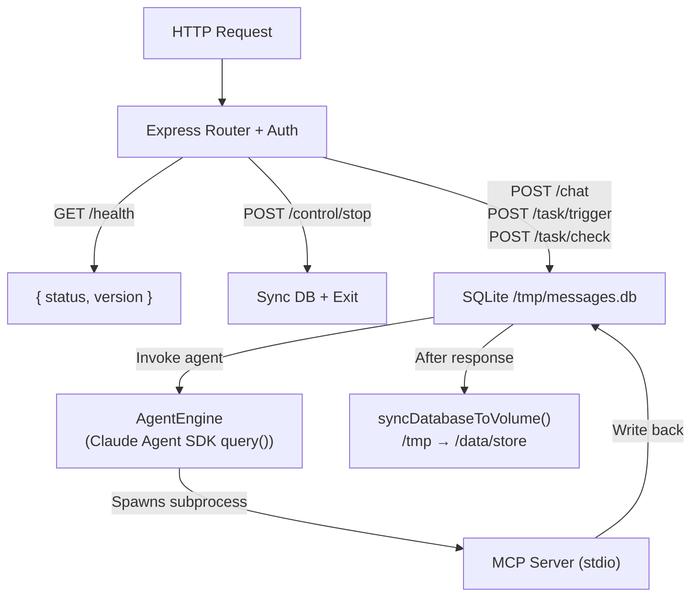
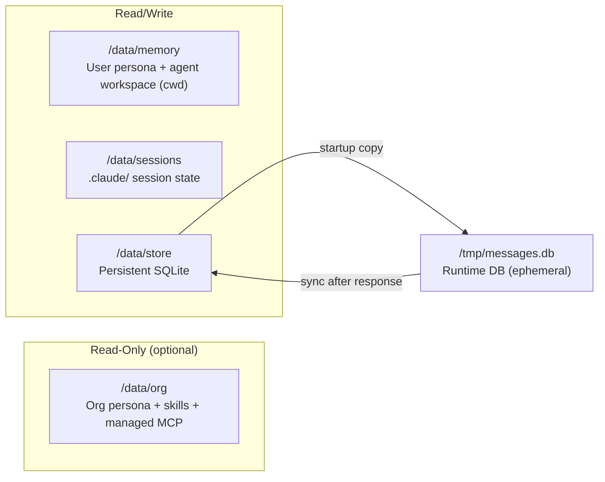
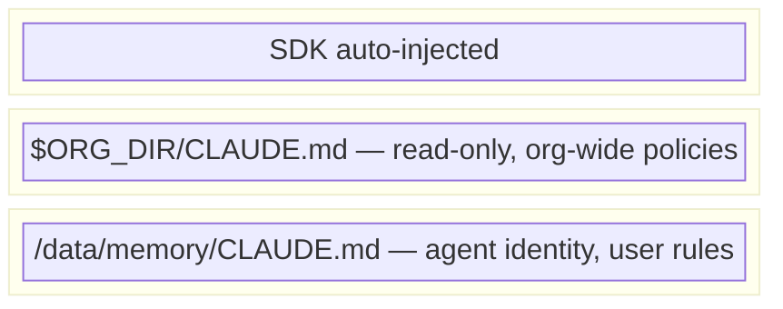
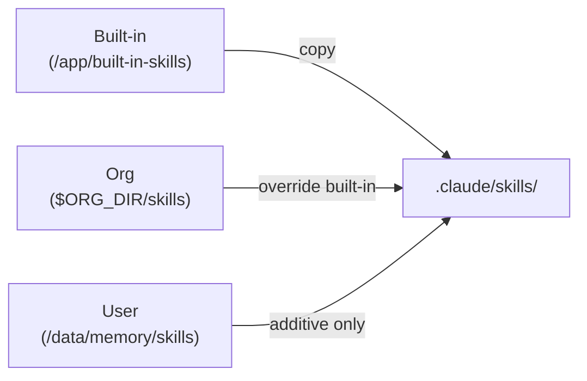

# PicoClaw

Serverless-first Claude Agent runtime. Request-driven HTTP API with persistent memory, multi-turn conversations, and scheduled tasks.

Forked from [NanoClaw](https://github.com/qwibitai/nanoclaw) — replaces the always-on multi-channel orchestrator with a single-container, per-request execution model designed for AWS Lambda, Alibaba Cloud FC, and similar platforms.

## Architecture



### Volume Layout



| Volume | Purpose |
|--------|---------|
| `/data/org` | Org persona (`CLAUDE.md`), org skills, `managed-mcp.json` — read-only, optional |
| `/data/memory` | User persona (`CLAUDE.md`), agent workspace (cwd) — read/write |
| `/data/sessions` | Claude session state (`.claude/`) — read/write |
| `/data/store` | Persistent SQLite database — read/write |

**Key difference from NanoClaw**: No Docker child containers. The agent runs in the same process as the HTTP server. Skills and memory are volume-mounted, not installed into the source tree.

## Quick Start

### Option 1: One-click script

```bash
git clone git@github.com:breakcafe/picoclaw.git
cd picoclaw
./picoclaw.sh
```

The script will prompt for `ANTHROPIC_BASE_URL` and `ANTHROPIC_API_KEY`, generate an `API_TOKEN`, build the Docker image, start the container, and run a smoke test.

### Option 2: Docker manually

```bash
# Build
docker build --platform linux/amd64 -t picoclaw:latest .

# Run (minimal — no org directory)
docker run --rm -it \
  -p 9000:9000 \
  -e API_TOKEN=your-token \
  -e ANTHROPIC_BASE_URL=https://api.anthropic.com \
  -e ANTHROPIC_API_KEY=sk-ant-xxx \
  -v $(pwd)/dev-data/memory:/data/memory \
  -v $(pwd)/dev-data/store:/data/store \
  -v $(pwd)/dev-data/sessions:/data/sessions \
  picoclaw:latest

# Run (with org directory)
docker run --rm -it \
  -p 9000:9000 \
  -e API_TOKEN=your-token \
  -e ANTHROPIC_BASE_URL=https://api.anthropic.com \
  -e ANTHROPIC_API_KEY=sk-ant-xxx \
  -e ORG_DIR=/data/org \
  -v $(pwd)/dev-data/org:/data/org:ro \
  -v $(pwd)/dev-data/memory:/data/memory \
  -v $(pwd)/dev-data/store:/data/store \
  -v $(pwd)/dev-data/sessions:/data/sessions \
  picoclaw:latest
```

### Option 3: Local Node.js

```bash
npm ci
npm run build
API_TOKEN=dev-token ANTHROPIC_BASE_URL=https://api.anthropic.com ANTHROPIC_API_KEY=sk-ant-xxx npm start
```

### Verify

```bash
# Health check
curl http://localhost:9000/health

# Send a message
curl -X POST http://localhost:9000/chat \
  -H "Authorization: Bearer your-token" \
  -H "Content-Type: application/json" \
  -d '{"message": "Hello, what can you do?"}'
```

## API Overview

All routes except `/health` require `Authorization: Bearer <API_TOKEN>`.

| Method | Path | Purpose |
|--------|------|---------|
| GET | `/health` | Liveness check |
| POST | `/chat` | Send message, get response (supports SSE) |
| GET | `/chat/:id` | Get conversation metadata |
| POST | `/task` | Create scheduled task (cron/interval/once) |
| GET | `/tasks` | List all tasks |
| PUT | `/task/:id` | Update task |
| DELETE | `/task/:id` | Delete task |
| POST | `/task/trigger` | Manually trigger a task |
| POST | `/task/check` | Execute next due task (for external cron) |
| POST | `/control/stop` | Graceful shutdown with data sync |

Full API documentation: [`docs/SERVERLESS_API_DEPLOYMENT_GUIDE.md`](docs/SERVERLESS_API_DEPLOYMENT_GUIDE.md)

OpenAPI spec: [`docs/api/openapi.yaml`](docs/api/openapi.yaml) / [`docs/api/openapi.json`](docs/api/openapi.json)

Postman collection: [`docs/api/postman_collection.json`](docs/api/postman_collection.json)

## Data Persistence

PicoClaw stores all state on mounted volumes. The container process itself is stateless.

```
/data/
  org/              # (optional) Org-level resources — read-only mount
    CLAUDE.md         # Org persona (organization-wide policies)
    managed-mcp.json  # Org MCP servers (Claude Code native format)
    skills/           # Org skills (authoritative)
  memory/           # User persona + agent workspace (cwd)
    CLAUDE.md         # User persona definition
    skills/           # User-created skills (additive, supplements org skills)
    conversations/    # Archived transcripts (rare — only on context compaction)
  sessions/         # Claude session state (.claude/)
  store/            # Persistent SQLite (synced from /tmp on every response)
    messages.db
```

On every HTTP response, the local database (`/tmp/messages.db`) is synced to the persistent volume. On shutdown (`SIGTERM` or `POST /control/stop`), a final sync runs before the process exits.

## Persona & System Prompt

PicoClaw assembles the agent's system prompt from a **two-tier CLAUDE.md** model:



| Tier | Source | Mechanism |
|------|--------|-----------|
| Org | `$ORG_DIR/CLAUDE.md` | `loadOrgClaudeMd()` → `systemPrompt.append` |
| User | `/data/memory/CLAUDE.md` | SDK auto-discovery via `cwd` + `settingSources` |

Both tiers are optional. Set `SYSTEM_PROMPT_OVERRIDE` to fully replace layers 1 + 2 with a custom string (layer 3 still loads).

## Skills

Skills are directories containing `SKILL.md` files that teach the agent new capabilities — no source code changes needed.

**Three-tier merge** (org skills take priority):



User skills supplement the merged set — they cannot override org or built-in skills of the same name.

See [`docs/SKILLS_AND_PERSONA_GUIDE.md`](docs/SKILLS_AND_PERSONA_GUIDE.md) for how to write skills and configure the agent persona.

## Serverless Deployment

### AWS Lambda

```bash
docker build --platform linux/amd64 \
  --build-arg ENABLE_LAMBDA_ADAPTER=true \
  -t picoclaw:lambda .
```

- Mount EFS to `/data`
- Set `MAX_EXECUTION_MS` below Lambda timeout (e.g., 270000 for 5-min Lambda)
- Use EventBridge Scheduler to call `POST /task/check` every minute

### Alibaba Cloud FC

- Deploy as custom-container with port 9000
- Mount NAS to `/data`
- Configure timer trigger for `/task/check`

See [`docs/SERVERLESS_API_DEPLOYMENT_GUIDE.md`](docs/SERVERLESS_API_DEPLOYMENT_GUIDE.md) for detailed deployment instructions.

## Downstream Integration

For developers building systems that call PicoClaw's HTTP API, see [`docs/API_INTEGRATION_GUIDE.md`](docs/API_INTEGRATION_GUIDE.md).

## Development

```bash
npm ci                    # install dependencies
npm run build             # compile TypeScript
npm test                  # run tests
npm run dev               # development mode (tsx watch)
npm run typecheck         # type checking only
```

Docker workflow:

```bash
make docker-build         # build image
make docker-run           # run with volume mounts
make test-chat            # smoke test /chat endpoint
make test-e2e             # full build + run + test pipeline
```

## Environment Variables

### Required

| Variable | Description |
|----------|-------------|
| `ANTHROPIC_BASE_URL` | Anthropic API base URL (default: `https://api.anthropic.com`). Set this when using a third-party API proxy or custom endpoint. |
| `ANTHROPIC_API_KEY` | Claude API key (or OAuth token equivalent) |
| `API_TOKEN` | Bearer token for HTTP API authentication |

### Optional

| Variable | Default | Description |
|----------|---------|-------------|
| `PORT` | `9000` | HTTP server port |
| `MAX_EXECUTION_MS` | `300000` | Maximum agent execution time (5 min) |
| `ASSISTANT_NAME` | `Pico` | Agent display name |
| `TZ` | System | Timezone for cron scheduling |
| `LOG_LEVEL` | `info` | Pino log level |
| `ORG_DIR` | (empty) | Org directory path — contains `CLAUDE.md`, `managed-mcp.json`, `skills/` |
| `STORE_DIR` | `/data/store` | Persistent database volume |
| `MEMORY_DIR` | `/data/memory` | User memory and persona volume (agent cwd) |
| `SKILLS_DIR` | `$ORG_DIR/skills` or `/data/skills` | Org skills directory |
| `SESSIONS_DIR` | `/data/sessions` | Session state volume |

## License

See [LICENSE](LICENSE).
